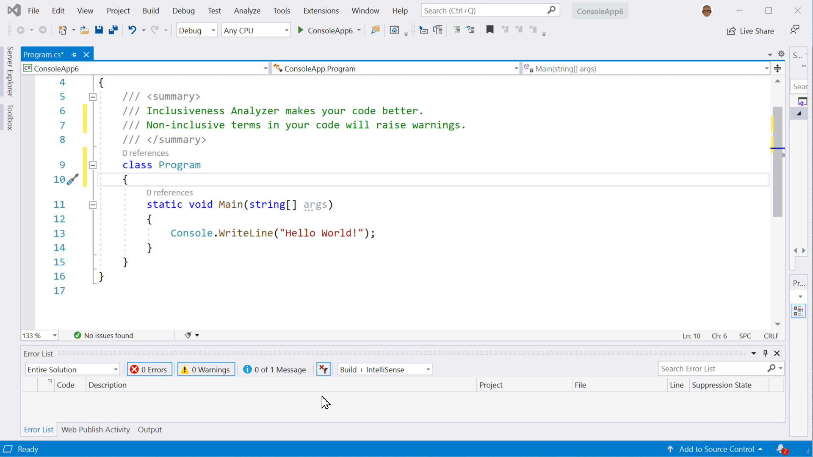
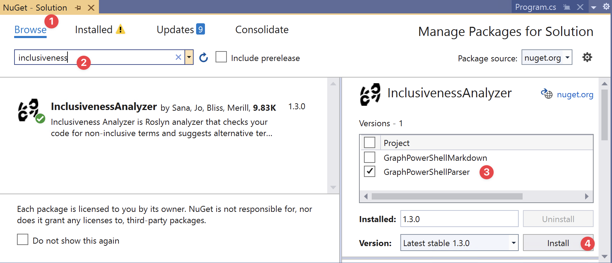
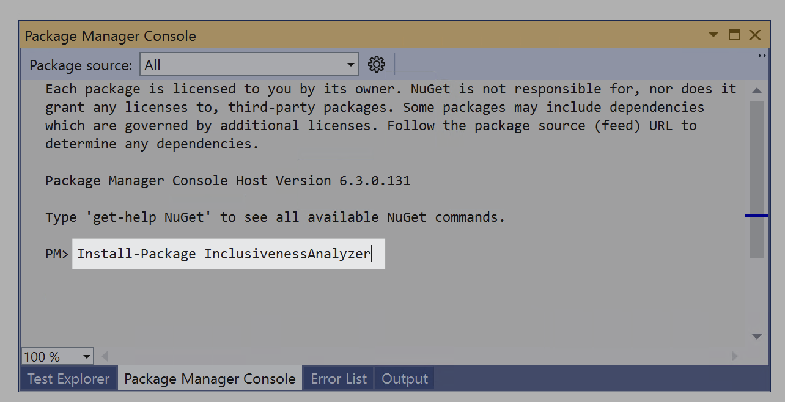
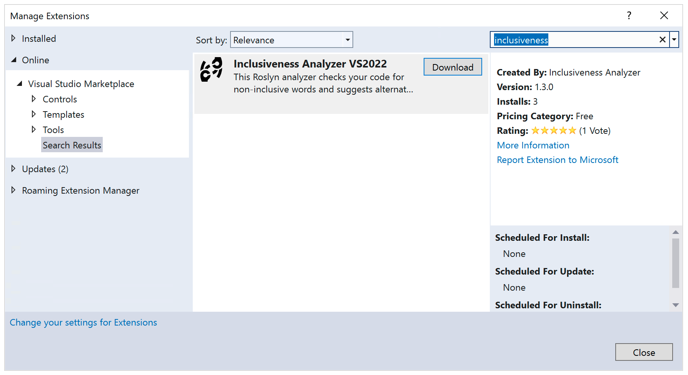

# Inclusiveness Analyzer

> Make your code inclusive!

The Inclusiveness Analyzer is a Visual Studio extension that checks code for offensive / exclusive terms.

It also provides context on why a word is exclusive and suggests alternate terms that can be used instead.

## Installing via the NuGet Package

The Inclusiveness Analyzer can be added to any C# project. Just install using NuGet and start writing code. The extension will be automatically loaded in Visual Studio for anyone that opens your project. Using the NuGet package is best when you are working on a project with a team.

[Get from NuGet](https://www.nuget.org/packages/InclusivenessAnalyzer/)

### Install using the NuGet Package Manager user interface

* Open the C# project using Visual Studio
* Select **Tools** from the menu
* Select **NuGet Package Manager**
* Select **Manage NuGet Packages for Solution...**
* Select **Browse**
* Search for **inclusiveness**
* Select the checkbox next to the project(s)
* Select **Install**

### Install using the NuGet Package Manager console

* Open the C# project using Visual Studio
* Select **Tools** from the menu
* Select **NuGet Package Manager**
* Select **Package Manager Console**
* Run `Install-Package InclusivenessAnalyzer`

> Important Note: The Inclusiveness Analyzer is only used during development time and does not affect your projects outputs or binaries.

## Installing as a Visual Studio Extension

If you would like the Inclusiveness Analyzer to run on any Visual Studio project you can install the extension directly into Visual Studio.

* View and install [Inclusiveness Analyzer for Visual Studio 2022](https://marketplace.visualstudio.com/items?itemName=InclusivenessAnalyzer.inclusivenessanalyzer2022)
* View and install [Inclusiveness Analyzer for Visual Studio 2019](https://marketplace.visualstudio.com/items?itemName=InclusivenessAnalyzer.inclusivenessanalyzer)

* Open Visual Studio 2019 or Visual Studio 2022
* Select **Extensions** from the menu
* Select **Manage Extensions**
* Search for **Inclusiveness**
* Select **Download**

The extension is scheduled for install. Your extension will be installed after all instances of Visual Studio have been closed.

Happy inclusive :heart: coding!

## Inclusiveness Analyzer for other Platforms

* [Inclusiveness Analyzer GitHub Action](https://github.com/microsoft/InclusivenessAnalyzer)
* [Inclusiveness Analyzer Azure DevOps Extension](https://github.com/microsoft/InclusivenessAnalyzerAzureDevOps)

## About the project

As humans, we hold many unconscious and implicit biases that we rely on to react quickly to our environment and any novel stimuli. However, since the unconscious brain processes and reacts with speed, we sometimes speak quickly without thinking, which may cause us to slip offensive terms and stereotypes although we mean no malice.

In order to confront these biases that we see in ourselves and others, we must rewire ourselves to regularly use inclusive practices (such as the words we speak). If you don't intentionally and proactively include, you will unintentionally exclude.

> Join our effort to push out exclusive terms and make inclusive terms a part of our everyday vocabulary!

Help us confront these biases by pushing out exclusive terms and making inclusive terms a part of our everyday vocabulary!

> Icons made by [Freepik](https://www.flaticon.com/authors/freepik) from [www.flaticon.com](https://www.flaticon.com/)

## Contributing

This project welcomes contributions and suggestions.  Most contributions require you to agree to a
Contributor License Agreement (CLA) declaring that you have the right to, and actually do, grant us
the rights to use your contribution. For details, visit https://cla.opensource.microsoft.com.

When you submit a pull request, a CLA bot will automatically determine whether you need to provide
a CLA and decorate the PR appropriately (e.g., status check, comment). Simply follow the instructions
provided by the bot. You will only need to do this once across all repos using our CLA.

This project has adopted the [Microsoft Open Source Code of Conduct](https://opensource.microsoft.com/codeofconduct/).
For more information see the [Code of Conduct FAQ](https://opensource.microsoft.com/codeofconduct/faq/) or
contact [opencode@microsoft.com](mailto:opencode@microsoft.com) with any additional questions or comments.

## Trademarks

This project may contain trademarks or logos for projects, products, or services. Authorized use of Microsoft 
trademarks or logos is subject to and must follow 
[Microsoft's Trademark & Brand Guidelines](https://www.microsoft.com/en-us/legal/intellectualproperty/trademarks/usage/general).
Use of Microsoft trademarks or logos in modified versions of this project must not cause confusion or imply Microsoft sponsorship.
Any use of third-party trademarks or logos are subject to those third-party's policies.
